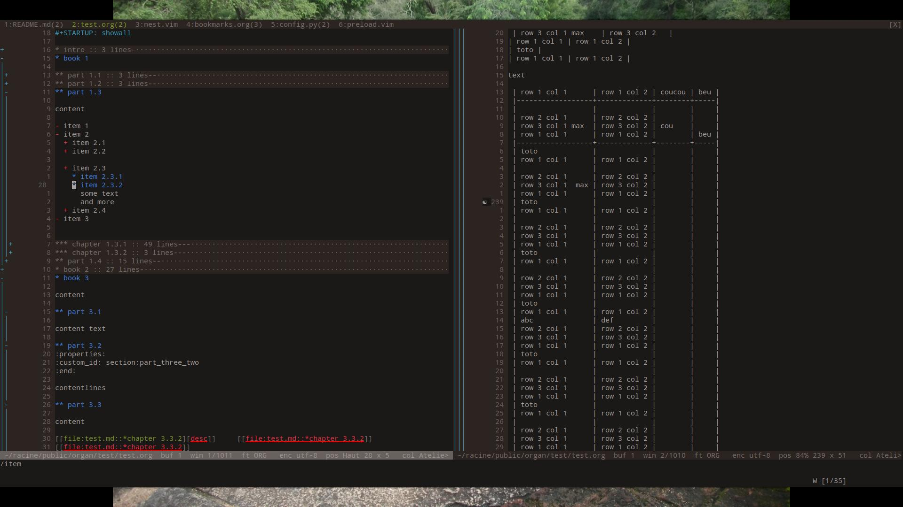
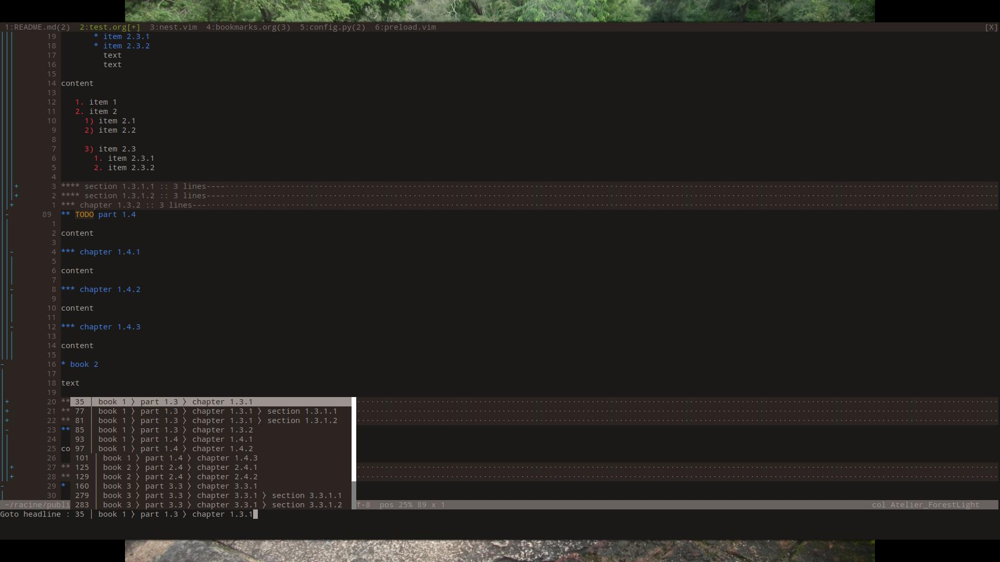

<!-- vim: set filetype=markdown: -->

<!-- vim-markdown-toc GFM -->

+ [Screenshots](#screenshots)
	* [History and meta-command](#history-and-meta-command)
	* [Frecency, dedicated buffers and layers](#frecency-dedicated-buffers-and-layers)
+ [Screencasts](#screencasts)

<!-- vim-markdown-toc -->

# Screenshots

## Folding, list & table

## Heading, completion & todo

